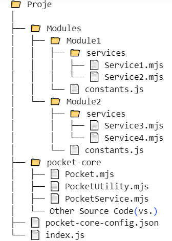

PocketStudio – Kendi Servislerini Geliştir, Test Et, Yayınla
PocketStudio, müşteri bazlı dinamik modül ve servis geliştirme olanağı sunan; öğrenciler, test kullanıcıları ve geliştiriciler için tasarlanmış özgür ve güvenli bir geliştirme platformudur.

Her kullanıcıya özel olarak tanımlanan Customer Code (Müşteri Numarası) ile:

Sadece size ait veritabanı ve koleksiyonlar üzerinde çalışabilir,

Kendi API servislerinizi yazabilir, test edebilir ve yönetebilirsiniz,

Gerçek zamanlı kod düzenleme, çalıştırma ve hata ayıklama işlemlerini doğrudan tarayıcınız üzerinden gerçekleştirebilirsiniz.

🚀 Öne Çıkan Özellikler
🔐 İzolasyonlu Ortam: Her kullanıcı yalnızca kendi tanımlı DB ve collection'ları üzerinde işlem yapabilir.

🧱 Modül ve Servis Tabanlı Yapı: Dinamik olarak yeni modüller ve servisler oluşturabilir, düzenleyebilir veya silebilirsiniz.

💻 Canlı Kod Çalıştırma: Tarayıcı üzerinden kod yazın, test edin ve sonuçları anında görün.

🌐 Free API Desteği: api.muratonay.com.tr domaini üzerinden müşteri kodunuzla kendi servislerinize güvenli ve sınırsız erişim sağlayın.

🎯 Kimin İçin?
👨‍🎓 Öğrenciler – Uygulamalı backend geliştirme deneyimi kazanmak isteyenler

🧪 Test Mühendisleri – Gerçek API'ler üzerinden senaryo ve davranış testi yapmak isteyenler

👩‍💻 Geliştiriciler – Mikroservis mimarileriyle çalışan, izole geliştirme alanına ihtiyaç duyanlar


# Pocket Sınıfı: Veri Saklama ve Yönetim Aracı Giriş
- Pocket sınıfı, JavaScript uygulamalarında veri saklama ve yönetimi için kullanılan kullanışlı bir araçtır. Bu makalede, Pocket sınıfının kullanımını ve sağladığı avantajları örneklerle açıklayacağız.

# Pocket Sınıfının Tanıtımı
- Pocket sınıfı, basit ve esnek bir veri saklama yöntemi sunar.
- Verileri anahtar-değer çiftleri olarak saklar ve bu verilere kolayca erişim sağlar.Ayrıca, Pocket nesneleri birleştirilebilir, kopyalanabilir ve özelleştirilebilir.

## Kurulum
- Pocket sınıfını kullanmak için öncelikle projenize eklemeniz gerekir. Bu sınıfı projenize eklemek için aşağıdaki adımları izleyebilirsiniz:

- Projeye Pocket sınıfının bulunduğu dosyayı ekleyin.
- Pocket sınıfını projenizde kullanmaya başlayın.
```javascript
import Pocket from './Pocket.js';
```


- Pocket sınıfını kullanmaya başlayın
```javascript
const myPocket = new Pocket();
```

# Temel Kullanım
## Değer Atama ve Alma
- Pocket sınıfıyla değer atama ve alma işlemleri **get** oldukça basittir:
```json
let data = {
     "user":{
          "userId":"1b2b3b4n5m6",
          "email":"user@user.com",
          "emailVerification":false,
          "blocked":false
     },
     "name":"murat"
}
```
```javascript
// Tüm json objeleri Pocket nesnesine ve
//Tüm indentlerdeki Array Obje indentlerini Pocket ve PocketList tipine dönüştürür.
let myPocket = PocketUtility.ConvertToPocket(data);

myPocket.put('name', 'murat');

// using 1
const name = myPocket.get('name','');
console.log(name); // Çıktı: murat

// using 2
const name = myPocket.get('surname','');
console.log(name); // Çıktı: ''

// using 3
const name = myPocket.get('surname',String);
console.log(name); // Çıktı: Invalid key: surname. It should not be a path.

// using 4
const email = myPocket.get('user.email',String);
console.log(name); // Çıktı: user@user.com.

// using 5
const response = myPocket.get("user.email.emailDetail",String);
console.log(response); // Çıktı: Invalid key: emailDetail. It should not be a path.

// using 6
const response = myPocket.get("user.email.emailDetail","");
console.log(response); // Çıktı: ''
```
## Pocket Nesnelerini Birleştirme
- Birden fazla Pocket nesnesini birleştirmek için **merge** metodunu kullanabilirsiniz:

```javascript
const pocket1 = new Pocket();
const pocket2 = new Pocket();

pocket1.put('age', 30);
pocket2.put('name', 'murat');

pocket1.merge(pocket2);

console.log(pocket1) // Çıktı: {"age":30,"name":"murat"}
```

## Pocket Nesnelerini Kopyalama
- Pocket nesnelerini kopyalamak için **clone** metodunu kullanabilirsiniz:

```javascript
const originalPocket = new Pocket();
originalPocket.put('color', 'blue');

const clonedPocket = originalPocket.clone();
console.log(clonedPocket.get('color')); // Çıktı: blue
```
## Pocket Nesnesi Boyutunu ve Anahtarları Alma

- Pocket nesnesinin boyutunu ve içerdiği anahtarları almak için <span style="background-color: #ffffcc">**getKeys()**</span> ve <span style="background-color: #ffffcc">**size()**</span> metodlarını kullanabilirsiniz:


```javascript
console.log(originalPocket.size()); // Çıktı: 1
console.log(originalPocket.getKeys()); // Çıktı: ['color']
```

## Pocket Nesnesi İçerisinde Anahtar Sorgulama
- Pocket nesnesinin içinde varolan bir anahtarın varlığı sorgulanabilir.

```javascript
const pocket = new Pocket();
pocket.put('name',"murat");

console.log(pocket.exist('name')) // output: true
console.log(pocket.exist('surname')) // output: false
```

# Servis Yapısı
<!--
📁 Proje
│
├── 📁 Modules
│   ├── 📁 Module1
│   │   ├── 📁 services
│   │   │   ├── 📄 Service1.mjs
│   │   │   └── 📄 Service2.mjs
│   │   └── 📄 constants.js
│   └── 📁 Module2
│       ├── 📁 services
│       │   ├── 📄 Service3.mjs
│       │   └── 📄 Service4.mjs
│       └── 📄 constants.js
├── 📁 pocket-core
│   ├── 📄 Pocket.mjs
│   ├── 📄 PocketUtility.mjs
│   ├── 📄 PocketService.mjs
│   └── Other Source Code(vs.)
├── 📄 pocket-core-config.json
└── 📄 index.js
-->


### Proje Yapısı ve Amaçları

Bu projede, modüllerin kendi sorumluluk alanları içerisinde geliştirme yapabilmesini ve birbirleriyle iletişim kurabilmesini sağlamak amacıyla bir yapı oluşturduk. Projede kullanılan ana yaklaşımlar şunlardır:

1. **Modüller ve Servisler:**
   - Her modül, kendi sorumluluk alanında geliştirme yapar ve bu modüllerin içerisinde servisler yer alır.
   - Servisler, modül sınırları içinde kullanılan işlevsel birimlerdir. Ancak bir modülün servisi, başka bir modül tarafından da çağrılabilir.

2. **Bağımsız Geliştirme:**
   - Projenin temel amacı, ekiplerin yalnızca kendi sorumlu oldukları modül üzerinde değişiklik yapabilmelerini sağlamaktır.
   - Bu sayede, hata düzeltme ve yeni özellik ekleme gibi işlemler bağımsız olarak gerçekleştirilebilir.

3. **Node Express Uyumluluğu:**
   - Proje, Node.js ve Express ile uyumludur.
   - Herhangi bir modül istenirse, istenilen servisleri bir API olarak açabilir.
   - Ayrıca, API olarak açılmayan servisler, kendi içlerinde tetiklenerek API'ye kaynak sağlayabilir.

4. **Constant Değişkenler:**
   - Her modül, kendi sabit değişkenlerini tutar ve kendi gereksinimlerine göre tasarlar.
   - Bu, modüllerin daha bağımsız ve özelleştirilebilir olmasını sağlar.

Bu yapı, ekiplerin daha verimli ve bağımsız bir şekilde çalışmasına olanak tanırken, proje genelindeki esnekliği ve genişletilebilirliği artırır.

# Service Genel Yapısı

```javascript
import { PocketLib } from "../constants.js"; // PocketLib kütüphanesi "../constants.js" dosyasından alınır. Tüm core kütüphaneleri class iisimleri girerek dışa aktarabiliriz.
const { PocketConfigManager, PocketLog, PocketMongo, PocketQueryFilter, PocketService, execute, dbClient, Pocket } = PocketLib; // Pocket kütüphanesi içinden gerekli modüller ve fonksiyonlar alınır

/**
 * Pocket GetData servisi
 * @param {Pocket} criteria - Sorgu kriterleri nesnesi
 * @returns {Promise<Array>} - Belirli bir veri kümesini içeren bir promise döner
 */
const GetData = execute(async (criteria) => { // GetData fonksiyonu async bir fonksiyondur ve execute fonksiyonu ile sarılır
     try {
          PocketService.parameterMustBeFill(criteria, "MANDATORY_KEY"); // criteria nesnesi içinde "MANDATORY_KEY" adında bir anahtarın olup olmadığını kontrol eder, yoksa hata fırlatır

          const responseService = await PocketService.executeService(`SERVICE_NAME`,`MODULE_NAME`,`PARAMETER_POCKET`); // SERVICE_NAME, MODULE_NAME ve PARAMETER_POCKET parametreleriyle bir servis çağrılır ve sonucu responseService değişkenine atanır

          let filter = new PocketQueryFilter(); // PocketQueryFilter sınıfından bir filtre nesnesi oluşturulur
          filter.add("MANDATORY_KEY", criteria.get("MANDATORY_KEY", String)).operator("=="); // Filtre, "MANDATORY_KEY" anahtarına ve veri tipine göre eşitlik operatörüyle eşit olmalıdır

          const searchResult = await new Promise((resolve, reject) => { // Asenkron bir Promise oluşturulur
               dbClient.executeGet({ // dbClient.executeGet fonksiyonu çağrılır
                    from: MONGO_QUERY_FROM_URL, // Belirli bir URL'den veri alınır
                    where: filter, // Filtre kullanarak sorgu yapılır
                    done: resolve, // İşlem başarılı olduğunda promise resolve edilir
                    fail: reject // İşlem başarısız olduğunda promise reject edilir
               });
          });

          if (searchResult.length === 0) { // Eğer arama sonucu boşsa
               PocketLog.error("No search result"); // Hata kaydı oluşturulur
          }
          return searchResult; // Arama sonucu döndürülür
     } catch (error) {
          PocketLog.error(`GetData servisinde hata meydana geldi."` + error); // Hata oluştuğunda kaydedilir
          throw new Error(error); // Hata fırlatılır
     }
});

export default GetData; // GetData fonksiyonu dışa aktarılır

```
# Service İnceleme

## Servis Root Yapı
- Servis içeriği root olarak **execute** metodu içerisine yazılır.
     ```javascript
     const GetData = execute(async (criteria) => {
          // Service içeriği
          ...
          return output;
     });

     export default GetData; /
     ```
- Servis inputlarının zorunluluk yönetimi
     ```javascript
     PocketService.parameterMustBeFill(criteria, "MANDATORY_KEY");
     ```
     -    **MANDATORY_KEY** parametre olarak **string** tür almaktadır. Örneğin servise input olarak 2'si zorunlu olmak şartıyla 3 parametre alıyoruz.
     -    Örneğin tcKimlikNo, telephoneNo, type alanlarını parametre olarak alan bir servis yazdık. tcKimlikNo alanı ve type alanı için zorunlu input girilmesi şartı koştuk, bu durumda yapı şu şekilde kurulur.
     ```javascript
     PocketService.parameterMustBeFill(criteria, "tcKimlikNo,type");
     ```
     - Bir başka örnekte ise alacağımız parametre bir obje içinde olabilir. Örneğin dizin yapısının şu şekilde olduğunu varsayalım.

          - address
            - addressNo:"001"
            - addressDetail:"Istanbul/Etiler"
          - generalInfo
            - birthDate:"19960101"

     - **customer** bizim **data** ile tabir ettiğimiz root dal. Müşteri bilgileri içerisinde **birthDate** alanı üzerinden sorgu yapmak istiyoruz ve bu parametrenin zorunlu olarak girilmesini istiyoruz.
```javascript
     PocketService.parameterMustBeFill(criteria, "address.addressNo");
```
